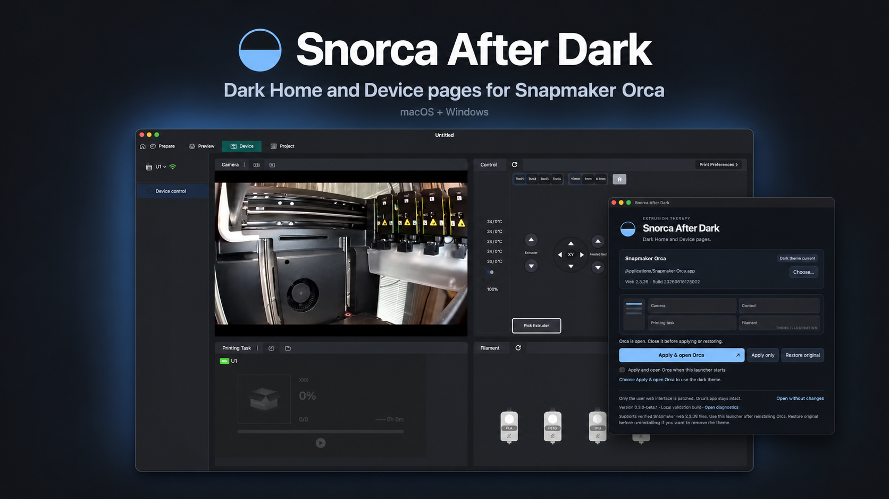

# Snorca After Dark

Dark Home and Device pages for **Snapmaker Orca**, matched to its native gray palette. Apply once, then close Snorca After Dark—the theme stays in place.

## Download

- **[Windows x64 installer](https://github.com/rdcstout/Snorca-After-Dark/releases/latest/download/Snorca-After-Dark-Setup-Windows-x64.exe)**
- **[Mac Apple silicon disk image](https://github.com/rdcstout/Snorca-After-Dark/releases/latest/download/Snorca-After-Dark-macOS-arm64.dmg)**

The Mac release is Developer ID signed and notarized. The Windows installer is unsigned. [Installation, restore, and removal](docs/USAGE.md).

- **[Linux x64 AppImage](https://github.com/rdcstout/Snorca-After-Dark/releases/latest/download/Snorca-After-Dark-Linux-x64.AppImage)**
- **[Linux Debian/Ubuntu installer](https://github.com/rdcstout/Snorca-After-Dark/releases/latest/download/Snorca-After-Dark-Linux-x64.deb)**

Version **0.3.2** is available for all three platforms. [Linux setup and removal](docs/LINUX.md).

## Use

1. Close Snapmaker Orca.
2. Open Snorca After Dark. If needed, use **Choose…** to select Orca's installation folder on Windows or its app on Mac.
3. Click **Apply only**, then open Orca normally. **Apply & open Orca** does both on Mac/Windows. On Linux, select Orca's configuration folder and click **Apply theme**.

**Restore original** removes the theme. Run the patcher again after reinstalling a compatible Orca version. It does not need to stay running.

## Compatibility

Supports Snapmaker Orca **2.3.6** (web **2.3.26 / 20260818172502**) and **2.4.0** (web **2.3.38 / 20260915154633**). Apply/restore checks pass against the official Windows, Mac, and Linux AppImage resources. The new 2.4.0 appearance is confirmed on Mac; Windows and Ubuntu were previously confirmed with 2.3.6. Hands-on 2.4.0 Windows/Linux testing, Flatpak runtime, and other Linux distributions remain unverified. Other builds and independently modified resources are refused until reviewed. The Orca application itself is not modified; changes are limited to its user web resources.

The app menu includes **Check for Updates** and optional quiet weekly checks. Downloads and installation stay under your control. Local prototype builds without a configured channel require one manual upgrade to this release.

## Help and source

[Report a bug](https://github.com/rdcstout/Snorca-After-Dark/issues) · [Security reports](SECURITY.md) · [Build from source](docs/DEVELOPMENT.md) · [MIT license](LICENSE)

Created by [Extrusion Therapy](https://extrusiontherapy.com). This is an independent utility, not affiliated with or endorsed by Snapmaker. The hero is promotional artwork based on an actual app screenshot.

## Support Future Tools

Snorca After Dark is free. You can optionally [support future Extrusion Therapy tools](https://buy.stripe.com/fZu3cw2Mnfr0d7N3ws1kA00). Downloads are never gated behind payment.
